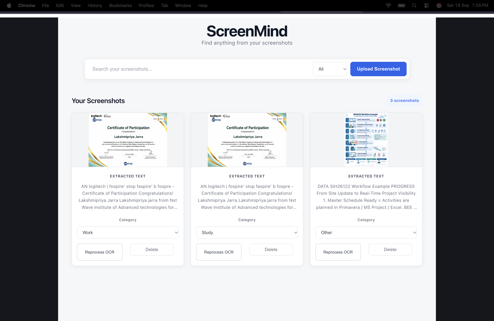

# ScreenMind 🧠

## AI-Powered Screenshot Search



ScreenMind is a smart screenshot management application that helps users find information hidden inside their screenshots.

## ✨ Features

- 📸 Upload and store screenshots
- 🔍 Search text inside screenshots
- 🧠 AI-powered semantic search
- 📝 OCR-based text extraction
- ⚡ Hybrid keyword + semantic search
- 🏷️ Screenshot categories
- 🔎 Search result highlighting
- 🔄 Reprocess OCR for difficult screenshots
- 💾 Persistent local storage using IndexedDB
- 🖼️ Fullscreen screenshot viewer
- ⬇️ Download screenshots
- 📤 Share screenshots
- 🗑️ Delete screenshots
- 📱 Responsive user interface

---

## 💡 Problem

People often save important information as screenshots:

- College information
- Certificates
- Wi-Fi details
- Notes
- Event details
- Application information
- Important messages
- Documents and links

Later, finding one particular screenshot can become difficult.

Users usually have to manually open multiple screenshots and search through them.

### ScreenMind solves this problem by making screenshots searchable.

Users can simply enter a word or concept, and ScreenMind finds the screenshots that are relevant to the search.

---

## 🚀 How ScreenMind Works

ScreenMind combines OCR, local storage, keyword search, and AI embeddings.

### 1. Upload

The user uploads one or more screenshots.

### 2. OCR

ScreenMind extracts visible text from the screenshot using **Tesseract.js**.

The extracted text becomes searchable.

### 3. Store

Screenshots and their extracted information are stored locally using **IndexedDB**.

### 4. Generate AI Embeddings

The extracted text can be converted into numerical vector representations using:

**Xenova/all-MiniLM-L6-v2**

These embeddings help ScreenMind understand similarity between the user's search query and screenshot content.

### 5. Search

ScreenMind combines multiple search techniques:

- Keyword matching
- Fuzzy matching
- Semantic similarity

This creates a hybrid search system.

### 6. Display Results

Relevant screenshots are displayed with:

- Relevance information
- Matching OCR text
- Search highlighting
- Screenshot actions

---

## 🧠 AI-Powered Semantic Search

ScreenMind does not depend only on exact keyword matching.

For example, a screenshot may contain:

> Connect your device to the campus wireless network.

A user searching for:

> Wi-Fi

can still find the relevant screenshot.

This is possible because ScreenMind uses semantic embeddings along with traditional text matching.

---

## 🛠️ Tech Stack

### Frontend

- React
- Vite
- JavaScript
- CSS

### OCR

- Tesseract.js

### AI / Machine Learning

- Hugging Face Transformers.js
- Xenova/all-MiniLM-L6-v2
- Text embeddings
- Cosine similarity

### Storage

- IndexedDB
- idb

### Development Tools

- VS Code
- Git
- GitHub

---

## 📁 Project Structure

```text
screenmind/
│
├── src/
│   ├── assets/
│   ├── App.jsx
│   ├── App.css
│   ├── database.js
│   ├── embedding.js
│   ├── ocr.js
│   ├── similarity.js
│   ├── index.css
│   └── main.jsx
│
├── public/
│
├── package.json
├── package-lock.json
├── vite.config.js
└── README.md